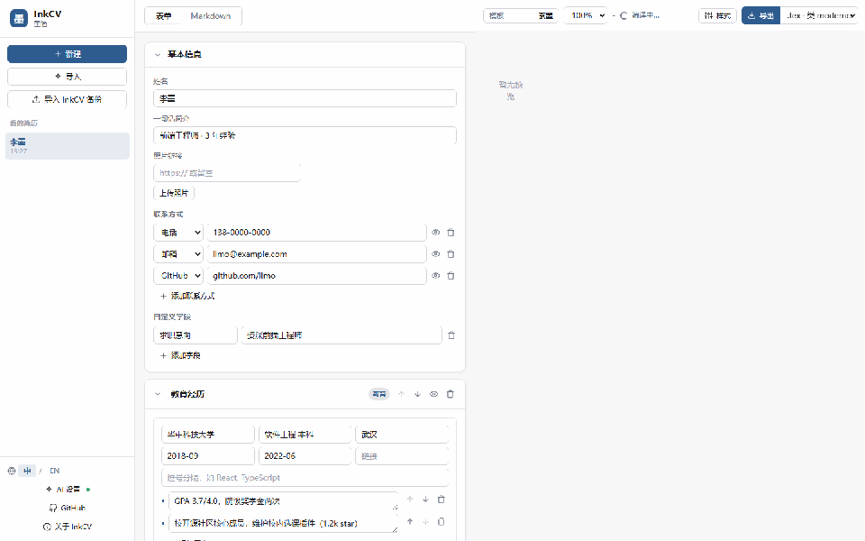
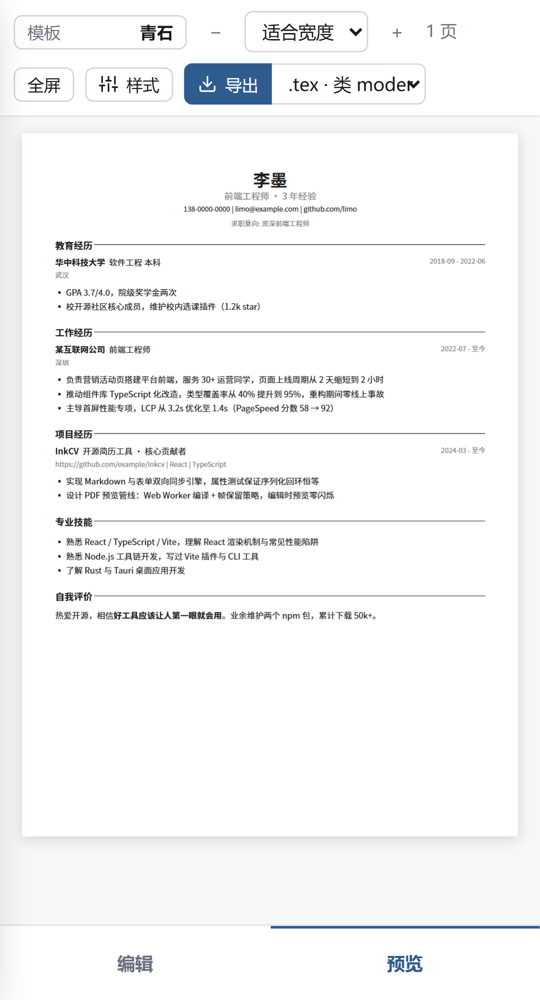
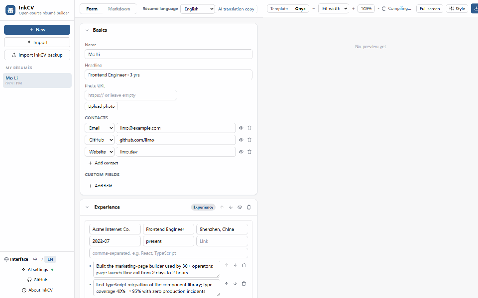
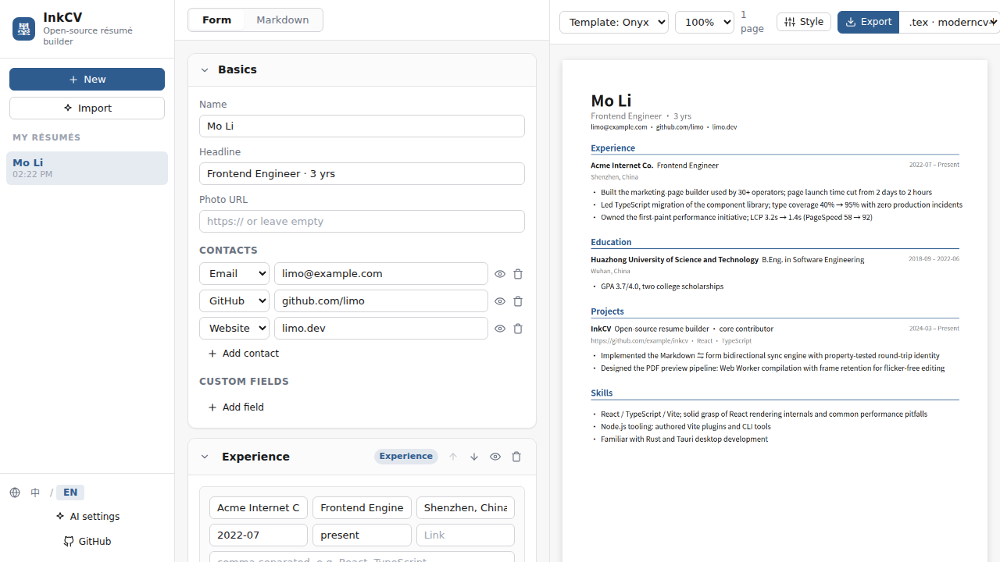
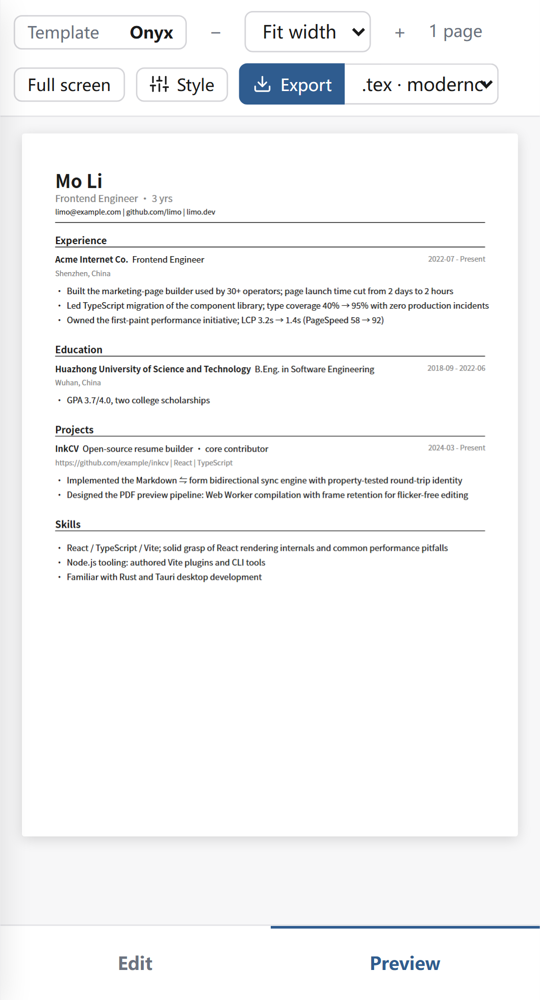

# InkCV · 墨简

> Local-first résumé builder with form and Markdown editing, true PDF preview, four focused layouts, BYO-key AI translation, backups, and portable exports.
>
> 本地优先的开源简历工具：表单与 Markdown 双模式编辑、真实 PDF 预览、四款精选布局、自带 Key 的 AI 翻译、备份与完整导出。

[在线版 / Web app](https://inkcv.vercel.app) · [桌面版 / Desktop downloads](https://github.com/DocJlm/InkCV/releases/tag/v0.3.0) · [反馈 / Feedback](https://github.com/DocJlm/InkCV/discussions) · [隐私说明 / Privacy](docs/PRIVACY.md) · [参与贡献 / Contributing](CONTRIBUTING.md)

> v0.3 is a public beta. Desktop packages are unsigned; read the installation notes below and verify the included SHA-256 file.
>
> v0.3 为公测版本。桌面安装包暂未签名，请阅读下方安装说明并核对随包提供的 SHA-256。



## 中文

### 为什么用 InkCV

- 表单和 Markdown 可随时切换，JSON 始终是唯一数据源，稳定 ID 在 Markdown 回环后保持不变。
- 预览与导出共用 `compileResume()`，你看到的 PDF 就是最终下载的 PDF。
- 玄墨、青石、极简 ATS、技术密排四款布局，支持中英文、照片、跨页与黑/蓝/自定义配色。
- 界面语言和简历正文相互独立；排版语言默认从正文自动识别，也可在高级样式中覆盖。AI 翻译会创建副本，原文不会被覆盖。
- 桌面工作台的列表、编辑器和预览可像 VS Code 一样拖拽调宽，双击分隔线恢复默认值。
- PDF 默认实时适宽；100% 使用真实 96 CSS DPI，并支持 50%–200%、全屏与高清重绘。
- 支持 PDF、Markdown、LaTeX；带照片时 LaTeX 自动导出为包含图片的 ZIP；`.inkcv` 可完整备份和恢复。
- AI 支持 OpenAI、DeepSeek、Anthropic、Moonshot/Kimi 与自定义 OpenAI-compatible 地址。所有模型名都可编辑。
- 无账号、无数据库、无云同步。简历保存在当前设备。
- 手机端提供“编辑 / 预览”完整工作台，桌面端提供 Tauri 原生文件对话框与系统凭据库。

桌面与手机界面：

| 桌面 | 手机 |
|---|---|
|  |  |

### AI Key 与隐私

InkCV 不提供公共 AI 额度，AI 功能需要你自己的 API Key。网页版把 Key 只保存在当前页面内存中，刷新或关闭后即清除；请求经同源 Vercel Function 转发，Function 不缓存、不持久化也不记录 Key。桌面版直接请求供应商，并优先把 Key 保存到 macOS Keychain、Windows Credential Manager 或 Linux Secret Service；凭据库不可用时会明确提示并仅保留到本次会话结束。

备份、Markdown、PDF、LaTeX 和浏览器存储都不会包含 AI Key。完整边界见 [隐私说明](docs/PRIVACY.md)。

### 本地运行

需要 Node.js 22+ 与 pnpm 11：

```bash
pnpm install
node packages/renderer/scripts/fetch-fonts.mjs
pnpm dev
```

打开 `http://localhost:5173`。同一个命令同时启动 Vite 页面、热更新和 `/api/ai/chat` 开发路由。

桌面端开发还需要 Rust stable 与平台对应的 Tauri 2 系统依赖：

```bash
pnpm --filter @inkcv/desktop dev
```

### 安装未签名桌面版

- Windows：SmartScreen 出现提示时，先核对 SHA-256，再选择“更多信息”与“仍要运行”。
- macOS：核对 SHA-256 后，在 Finder 中按住 Control 点击应用并选择“打开”；也可在“隐私与安全性”中允许本次启动。
- Linux：AppImage 需要执行权限；Debian/Ubuntu 可安装 `.deb`。部分桌面环境未运行 Secret Service 时，AI Key 会退化为仅会话保存。

## English

### Highlights

- Switch between approachable forms and Markdown while JSON remains the single source of truth.
- Preview and export share the exact same react-pdf compile path.
- Four focused bilingual layouts with photos, multi-page content, black, blue, and custom colors.
- Interface and résumé languages are independent; AI translation creates a validated copy and never overwrites the source.
- Fit-width PDF preview, true 96 CSS DPI at 100%, 50%–200% zoom, and full screen.
- Export PDF, Markdown, LaTeX or a photo-aware ZIP, plus a complete `.inkcv` backup.
- Bring your own OpenAI, DeepSeek, Anthropic, Moonshot/Kimi, or compatible provider key.
- No account, database, cloud sync, or bundled AI credit.
- Full mobile edit/preview workspace and a Tauri desktop shell for Windows, macOS, and Linux.

### Development and verification



| Desktop | Mobile |
|---|---|
|  |  |

```bash
pnpm install
node packages/renderer/scripts/fetch-fonts.mjs
pnpm test
pnpm typecheck
pnpm --filter @inkcv/web build
pnpm test:e2e
```

The monorepo contains `packages/core`, `renderer`, `exporters`, `ai`, and `ui`, plus `apps/web` and `apps/desktop`. Pull requests must preserve Markdown round-trip identity and the single PDF rendering path; see [CONTRIBUTING.md](CONTRIBUTING.md).

### Vercel

Create a Vercel project from this repository, set **Root Directory** to `apps/web`, and enable access to source files outside that directory so pnpm workspace packages are included. Nitro is detected automatically. Do not configure provider keys. Optionally set `INKCV_ALLOWED_AI_HOSTS` to a comma-separated list of extra public HTTPS provider hosts. Pull requests receive Preview deployments and `main` deploys to Production through Vercel's Git integration.

## Design references

InkCV's templates are original react-pdf implementations inspired by the configurable Chinese typography of [BingyanStudio/LapisCV](https://github.com/BingyanStudio/LapisCV), the classic hierarchy of [billryan/resume](https://github.com/billryan/resume), the density principles of [Resume-NG](https://github.com/fky2015/resume-ng), and the scenario descriptions in [JSON Resume](https://jsonresume.org/). We also acknowledge [geekplux/cv_resume](https://github.com/geekplux/cv_resume), [hijiangtao/resume](https://github.com/hijiangtao/resume), and [liweitianux/resume](https://github.com/liweitianux/resume). No HTML, CSS, or TeX rendering path is copied.

## Known v0.3 beta limits

- Desktop packages are not code-signed, notarized, distributed through app stores, or auto-updated.
- “Minimal ATS” is designed for readable text extraction but is not a certification or universal ATS guarantee.
- Provider compatibility is contract-tested; actual availability, billing, model names, and output remain controlled by each provider.
- Data is local to one browser profile or desktop installation. There is no automatic device sync.

## License

[MIT](LICENSE)
